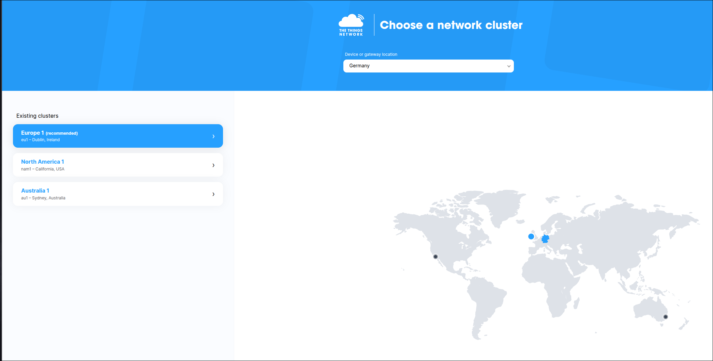
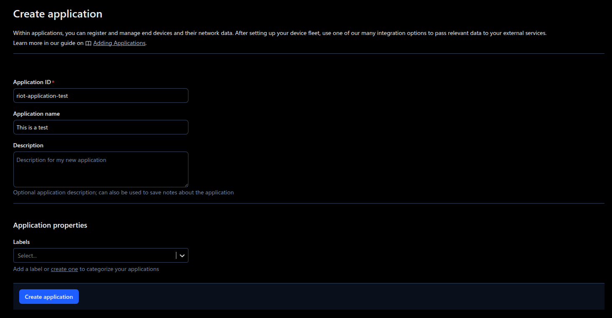
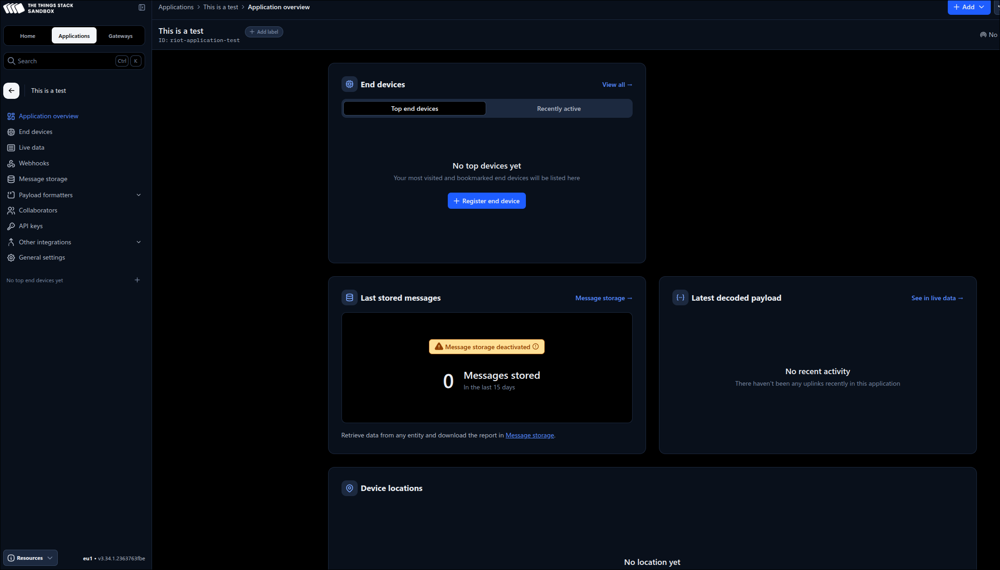
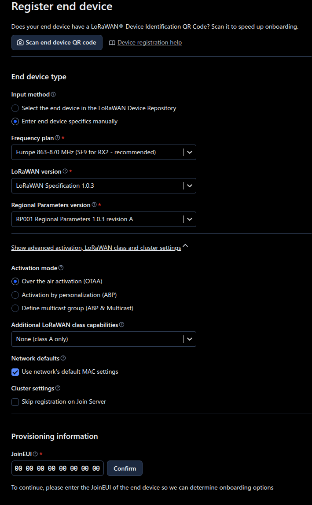

# LoRaWAN

SAUL is a generic actuator/sensor interface in RIOT. Its purpose is to enable
unified interaction with a wide range of sensors and actuators through a set of
defined access functions and a common data structure.

Each device driver implementing this interface has to expose a set of predefined
functions, and it has to register itself to the central SAUL registry. From here
devices can be found, listed, and accessed.

Each device exposes its name and type. This information can be used for
automated searching and matching of devices (e.g. connect light sensor
automatically with the color of an RGB LED...).

To learn more about SAUL and the registry, check the online documentation
[here](https://doc.riot-os.org/group__drivers__saul.html) and
[here](https://doc.riot-os.org/group__sys__saul__reg.html).

To change to this directory from a different exercise, use the following command in the terminal.

```sh
$ cd ../04-saul
```

## Task 1

1. With your browser access The Things Network at [https://www.thethingsnetwork.org/](https://www.thethingsnetwork.org/),
and create an account for yourself by clicking on the "Sign Up" button.

2. Once you have an account, navigate to the console at [https://console.cloud.thethings.network/](https://console.cloud.thethings.network/), and choose the "Europe 1" cluster.



3. On your console, start the creation of a new application, by clicking "Create application".


4. Set your application ID and description, then confirm with "Create application".



5. From the panel that shows your application overview, click on "+ Register end device", inside the "End devices" section.



6. To register the device, choose to "Enter end device specifics manually", so we can provide the configuration. Follow this configuration, make sure to "Show advanced activation, LoRaWAN class and cluster settings":

| Parameter | Value |
| --------- | ----- |
| Frequency plan | "Europe 863-870 MHz (SF9 for RX2 - recommended)" |
| LoRaWAN version | "LoRaWAN Specification 1.0.3" |
| Regional Parameters version | "RP001 Regional Parameters 1.0.3 revision A" |
| Activation mode | "Over the air activation (OTTA)" |
| Additional LoRaWAN class capabilities | "None (class A only)" |
| Use network's default MAC settings | True |
| Join EUI | `00 00 00 00 00 00 00 00` |



7. Once you entered the Join EUI, click on "Confirm". Generate the DevEUI and AppKey by clicking on "Generate".
8. Enter a unique name for your device, and click on "Register end device"
9. From the device overview panel, copy the "AppEUI", "DevEUI", and "AppKey" values, and replace them in the Makefile of this exercise.

## Task 2

1. To be able to send data, we first need to determine which network interface to use. We can iterate the register of network interfaces, until we find the one that has a LoRa device (in our case the device will have also a IEEE802.15.4 radio as a second interface). We need to implement `find_lorawan_network_interface` in `main.c`. The function should return a pointer to the first found lora interface. We start by initializing local variables:
```C
netif_t *netif = NULL;
uint16_t device_type = 0;
```
We need to iterate the register and for each interface check the device type. In case we finish the iteration and didn't find a valid interface, the returned value should be `NULL`:
```C
do {
    netif = netif_iter(netif);
    if (netif == NULL) {
        puts("No network interface found");
        break;
    }
    netif_get_opt(netif, NETOPT_DEVICE_TYPE, 0, &device_type, sizeof(device_type));
} while (device_type != NETDEV_TYPE_LORA);

return netif;
```

2. Now that we found the correct interface, we need to join the network. We'll be using the [OTAA join method](https://www.thethingsnetwork.org/docs/lorawan/end-device-activation/#over-the-air-activation-in-lorawan-10x).
We'll implement the `join_lorawan_network` function, which receives the interface that was found before.
The procedure is:
- iteratively attempt to join the network
- wait for a few seconds
- check the result

```C
netopt_enable_t status;
uint8_t data_rate = 5;
int result;

while (1) {
    status = NETOPT_ENABLE;
    printf("Joining LoRaWAN network...\n");
    netif_set_opt(netif, NETOPT_LINK, 0, &status, sizeof(status));

    /* Wait for a while to allow the join process to complete */
    ztimer_sleep(ZTIMER_MSEC, 10000);

    result = netif_get_opt(netif, NETOPT_LINK, 0, &status, sizeof(status));
    if (result != 0 || status == NETOPT_ENABLE) {
        printf("Joined LoRaWAN network successfully\n");
        netif_set_opt(netif, NETOPT_LORAWAN_DR, 0, &data_rate, sizeof(data_rate));
        status = NETOPT_DISABLE;
        netif_set_opt(netif, NETOPT_ACK_REQ, 0, &status, sizeof(status));
        return;
    } else {
        netif_set_opt(netif, NETOPT_LINK, 0, &status, sizeof(status));
        printf("Failed to join LoRaWAN network, retrying...\n");
    }
}
```

3. Finally, we can send data via LoRaWAN whenever we read a new button state. For this, implement `send_lorawan_packet`.

Create a new packet buffer for our data:
```C
    packet = gnrc_pktbuf_add(NULL, &data, sizeof(data->val[0]), GNRC_NETTYPE_UNDEF);
    if (packet == NULL) {
        puts("Failed to create packet");
        return -1;
    }
```

Now, we need a packet header:
```C
    header = gnrc_netif_hdr_build(NULL, 0, &address, sizeof(address));
    if (header == NULL) {
        puts("Failed to create header");
        gnrc_pktbuf_release(packet);
        return -1;
    }

```

As a last step, we add the header to the buffer:
```C
packet = gnrc_pkt_prepend(packet, header);
netif_header = (gnrc_netif_hdr_t *)header->data;
netif_header->flags = 0x00;
```
We can now send the packet:
```C
result = gnrc_netif_send(container_of(netif, gnrc_netif_t, netif), packet);

if (result < 1) {
    printf("error: unable to send\n");
    gnrc_pktbuf_release(packet);
    return 1;
}

return 0;
```
